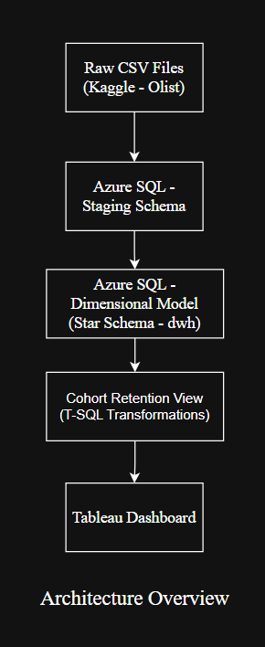
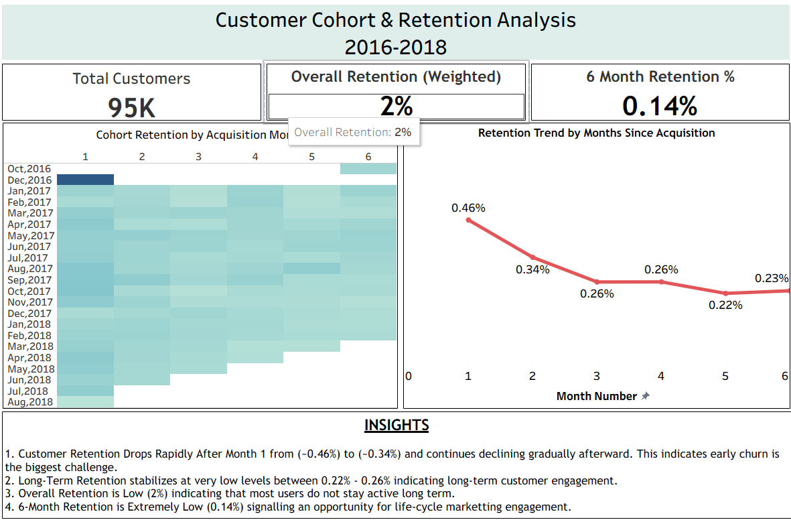

# Azure SQL Customer Cohort & Retention Analysis

End-to-end Analytics Engineering project built using **Azure SQL** and **Tableau** to analyze customer retention behavior using cohort modeling.

This project transforms raw transactional e-commerce data into a structured dimensional data warehouse and derives cohort-based retention insights through SQL and BI visualization.

---

## 📌 Project Overview

This project demonstrates:

- Azure SQL database provisioning
- Staging-to-warehouse data architecture
- Star schema implementation
- Surrogate key modeling
- Fact table grain control
- Referential integrity enforcement
- Performance indexing
- Cohort retention modeling in T-SQL
- Tableau KPI and LOD-based metric validation

Dataset Source:  
Olist Brazilian E-Commerce Public Dataset (Kaggle)

---

# 🏗 Architecture Overview

## Data Flow

---

## 🔹 Staging Layer

- Raw CSV data loaded into Azure SQL
- Tables mirror original source structure
- No transformations applied
- Preserves source integrity

---

## 🔹 Data Warehouse Layer (dwh Schema)

A Star Schema model was implemented.

### ⭐ Fact Table: `dwh.fact_orders`

**Grain:**  
One row = One order-item purchased by a customer

This ensures:
- Accurate revenue aggregation
- Correct retention modeling
- No duplication across joins

#### Measures:
- price
- freight_value
- payment_value

#### Foreign Keys:
- customer_key
- product_key
- seller_key
- order_date_key

---

### 📘 Dimension Tables

#### `dwh.dim_customers`
- customer_key (surrogate key)
- customer_id
- customer_unique_id (true customer identity)
- location attributes

`customer_unique_id` is used for retention calculations.

---

#### `dwh.dim_products`
- product_key
- product attributes
- physical metadata

---

#### `dwh.dim_sellers`
- seller_key
- seller geographic attributes

---

#### `dwh.dim_date`
Derived from order_purchase_timestamp:
- date_key
- full_date
- year
- month
- day
- quarter
- month_name

---

# 🔗 Referential Integrity & Performance

### Foreign Key Constraints

- fact_orders → dim_customers
- fact_orders → dim_products
- fact_orders → dim_sellers
- fact_orders → dim_date

Ensures dimensional consistency.

---

### Performance Optimization

- Non-clustered indexes on fact_orders foreign keys
- Optimized star-schema joins
- Structured execution order
- Cohort view built on curated warehouse schema

---

# 📊 Cohort Retention Logic (SQL Layer)

Cohort logic is implemented in:

`dwh.vw_customer_cohort`

---

## Step 1 – Identify First Purchase

```sql
MIN(full_date)
GROUP BY customer_unique_id
```
## Step 2 – Derive Cohort Month

```sql
DATEFROMPARTS(
    YEAR(first_purchase_date),
    MONTH(first_purchase_date),
    1
)
```
## Step 3 – Calculate Month Offset

```sql
DATEDIFF(MONTH, first_purchase_date, full_date)
```
## Step 4 – Count Active Customers

```sql
COUNT(DISTINCT customer_unique_id)
```
Final output grain:

CohortMonth × Month_Number × Active_Customers

---
# 📈 Tableau Dashboard



Dashboard KPIs

- Total Customers: ~95K
- Overall Retention: ~2%
- 6-Month Retention: ~0.14%
- Cohort Retention Heatmap
- Retention Decay Trend Line

---
# 📊 Tableau Calculated Metrics

## Cohort Size

```tableau
{FIXED [Cohort Month]:
    SUM(IF [Month Number] = 0 THEN [Active Customers] END)
}
```
Defines acquisition size per cohort.

## Retention %

```tableau
SUM([Active Customers]) / SUM([Cohort Size])
```

## Total Acquired Customers

```tableau
SUM(IF [Month Number] = 0 THEN [Active Customers] END)
```
## Total Retained Customers

```tableau
SUM(IF [Month Number] > 0 THEN [Active Customers] END)
```

## Overall Retention

```tableau
[Total Retained Customers] / [Total Acquired Customers]
```

## 6-Month Retention
```tableau
SUM(IF [Month Number] = 6 THEN [Active Customers] END)
/ [Total Acquired Customers]
```
---

# 📈 Key Business Insights

Retention drops sharply after Month 1.
- Long-term retention stabilizes at extremely low levels (~0.22–0.26%).
- 6-month retention is only ~0.14%.
- Early churn is the primary business challenge.
- Significant opportunity exists for lifecycle marketing and engagement strategies.

---

# 📂 Repository Structure

```
azure-cohort-retention-analysis/
│
├── architecture/
│   └── architecture_overview.png
│
├── dashboard/
│   ├── customer-cohort-retention-analysis.twb
│   └── customer_cohort_dashboard.png
│
├── data/
│   ├── olist_customers_dataset.csv
│   ├── olist_order_items_dataset.csv
│   ├── olist_order_payments_dataset.csv
│   ├── olist_orders_dataset.csv
│   ├── olist_products_dataset.csv
│   ├── olist_sellers_dataset.csv
│   └── product_category_name_translation.csv
│
├── sql/
│   ├── 01_create_staging_tables.sql
│   ├── 02_create_dimension_tables.sql
│   ├── 03_create_fact_table.sql
│   ├── 04_dimension_constraints.sql
│   ├── 05_create_performance_indexes.sql
│   └── 06_customer_cohort_view.sql
│
└── README.md
```
---

# 🧠 Skills Demonstrated

- Azure SQL environment setup
- Dimensional data modeling
- Surrogate key implementation
- Fact grain management
- Foreign key constraint enforcement
- Index-based performance tuning
- Cohort transformation logic in SQL
- Tableau LOD-based KPI validation
- End-to-end analytics engineering workflow

---

# 🚀 Potential Enhancements

- Incremental fact table loading
- Data validation layer
- Azure Data Factory orchestration
- Automated testing
- Materialized retention aggregates

---

# 👤 Author
Prajwal Anand
SQL | Azure SQL | Data Warehousing | Analytics Engineering | Tableau
